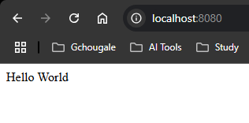

create any spring project with spring inititalizer with only `spring web` dependancy.  
create new class with name `Hello.java` at `src/main/java/com.example.demo` package.  
```java
package com.example.demo;

import org.springframework.web.bind.annotation.RequestMapping;
import org.springframework.web.bind.annotation.RestController;

@RestController
public class Hello {

    @RequestMapping("/")
    public String greet(){
        return "Hello World";
    }
}
```  
& then run the programm  
Open browser with URL : `http://localhost:8080/`  
### Preview:  
  