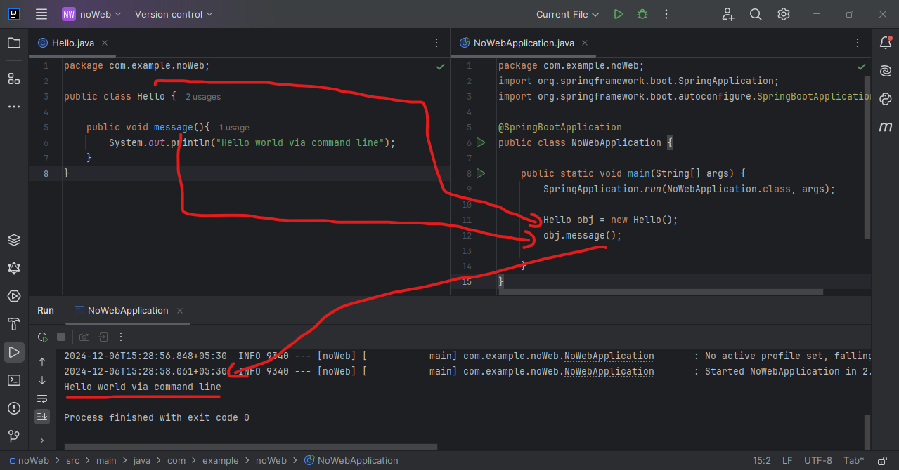
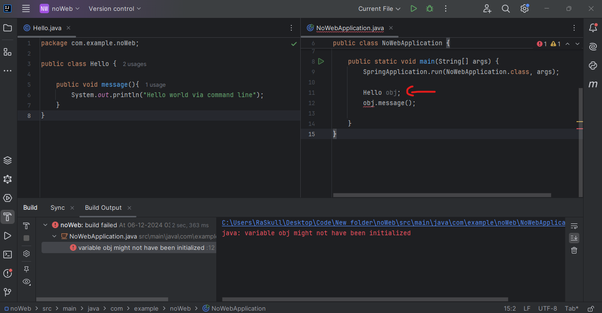
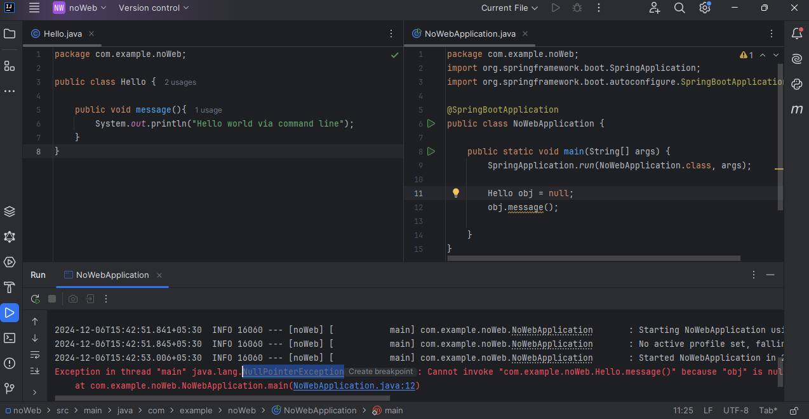
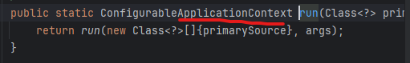
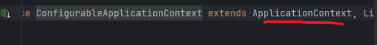
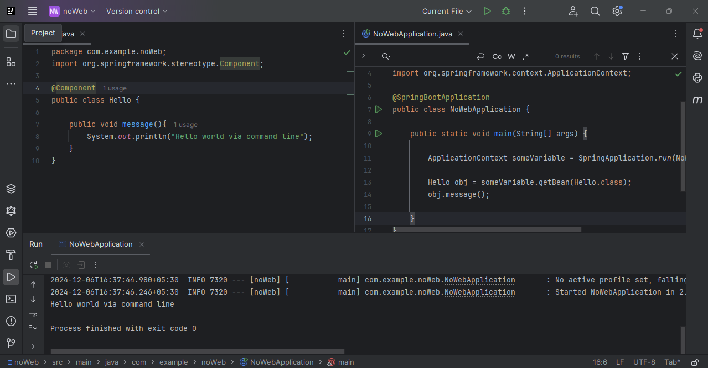

create any spring project with spring inititalizer with no dependancy. 
create new class with name `Hello.java` at `src/main/java/com.example.demo` package.  
```java
package com.example.noWeb;

public class Hello {

    public void message(){
        System.out.println("Hello world via command line");
    }
}
```  
create instance of `hello` class & then drill the function.  
```java
package com.example.noWeb;
import org.springframework.boot.SpringApplication;
import org.springframework.boot.autoconfigure.SpringBootApplication;

@SpringBootApplication
public class NoWebApplication {

	public static void main(String[] args) {
		SpringApplication.run(NoWebApplication.class, args);

		Hello obj = new Hello();
		obj.message();

	}
}
```  
### Preview:  
  

every time we create a instance of class object it a IOC container inside JVM. like in this example  
`Hello obj = new Hello();`  
this line is creating a one container into JVM heap memory.  
but here is one problem. here `we explicity` creating intance instead of letting spring take care of it.  
& thus this instace exits in JVM heap memory & not in IOC container.  
so if we decide to assinging no value obj
### Preview:  
<!-- `Hello obj = new Hello();`   -->
`Hello obj;`  
  
or assinging null value to obj.  
### Preview:  
`Hello obj = null;`  
  


so how to solve this?  
the default solution is `ApplicationContext`  
but we need to have to make some changes.  
1. mark the class with `@Component` annotation.  
2. withing main class assing main method to `ApplicationContext`  
```java
		ApplicationContext someVariable = SpringApplication.run(NoWebApplication.class, args);
```  
why this will work?  
because if we inspect `run` methods we can see  
### Preview:  

we can see run returns `ConfigurableApplicationContext`  
& if inspect `ConfigurableApplicationContext`  we can see it extends `ApplicationContext`  
### Preview:  
  
2. `Hello obj = someVariable.getBean(Hello.class);`  
### Preview:  
  