we won't use spring intit website for this, instead we will use & IDE & Maven as a build tool.  
1. `file` >> `new project` >> & choose Maven  
### Preview:  
im using Inteliij for now & this is how it looks  
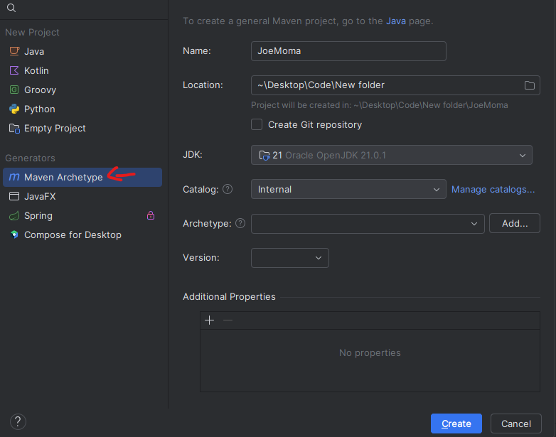  
& from internal option choose quickstart, then create.  
### Preview:  
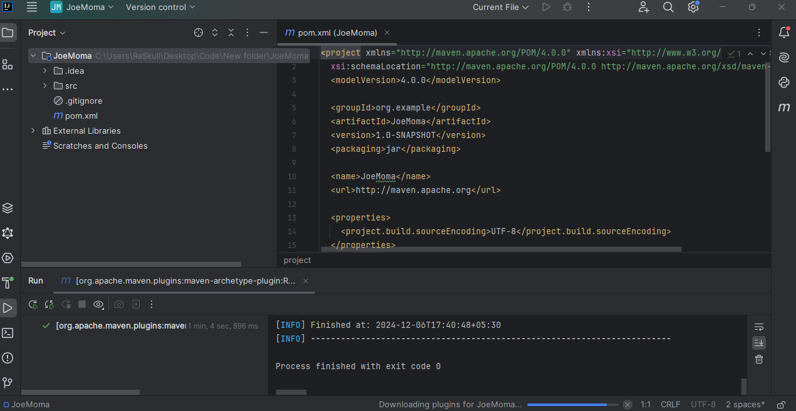  
this is not a spring project, this is just a vanilla maven project.  
2. now we can create a file log something in it & by instantiating that object in main class we can use those print method, like this  
### Preview:  
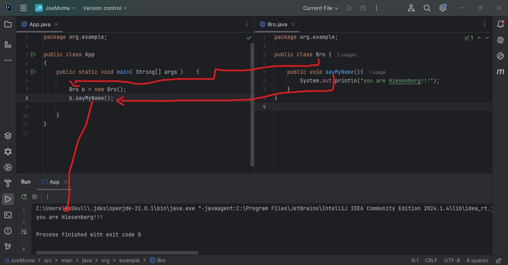  
but we wont be using `new Bro();` here, because we are mimicing spring framework.  
& if we see the libraries section we can't see much there  
### Preview:  
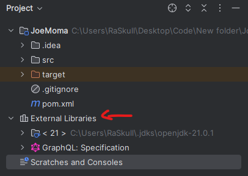  
3. so we need to inject spring framework into our project, how we do that?
by adding dependacy into `pom.xml` (project object model)  
### Preview:  
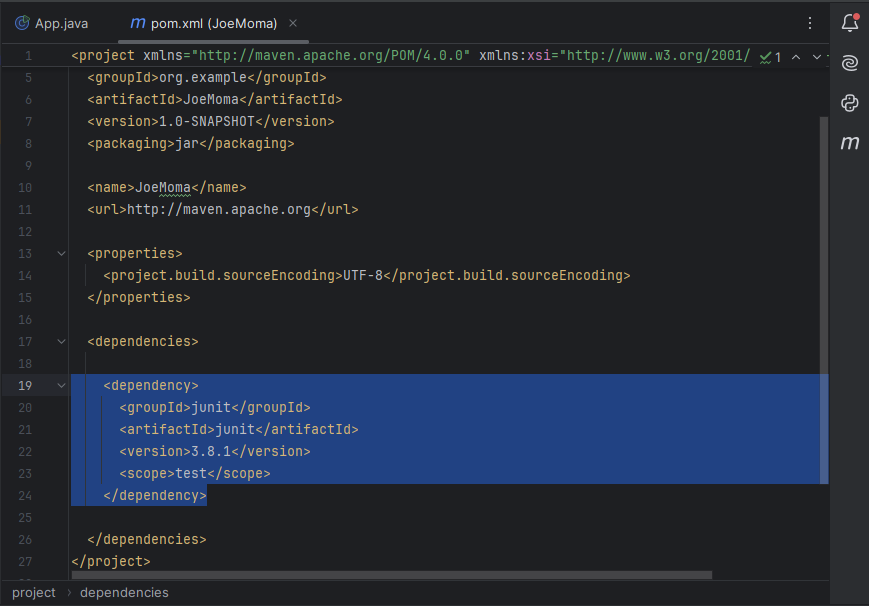  
here we already has the `junit` dependancy.  
now we need to add spring too  
for that we have formatt like this  
```xml
    <dependency>
      <groupId></groupId>
      <artifactId></artifactId>
      <version></version>
      <scope></scope>
    </dependency>
```  
the official webiste to get maven build repositories is **mvnrepo** : `https://mvnrepository.com/`  
### Preview:  
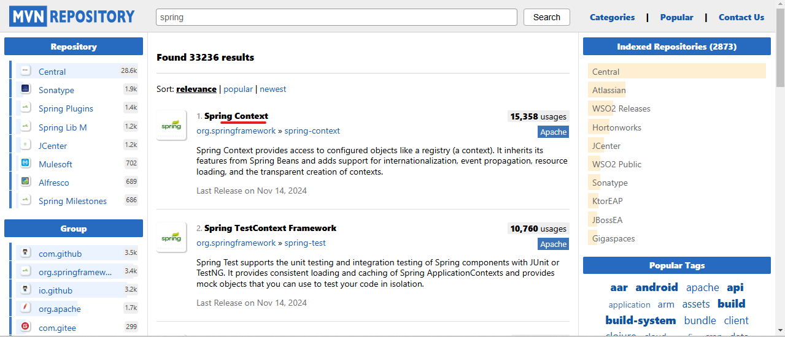  
pick the stable or recently most used version & paste it in `pom.xml`  
### Preview:  
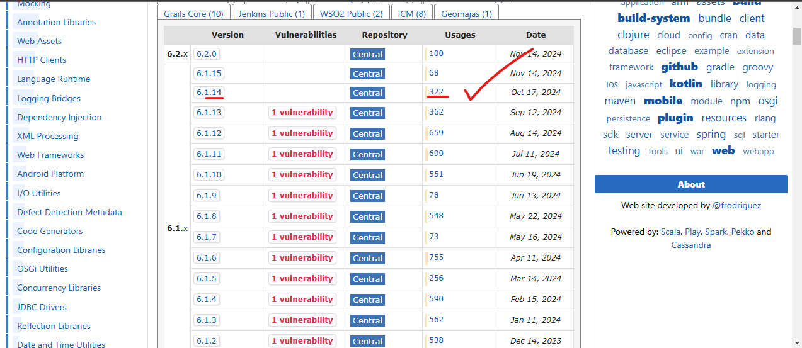  
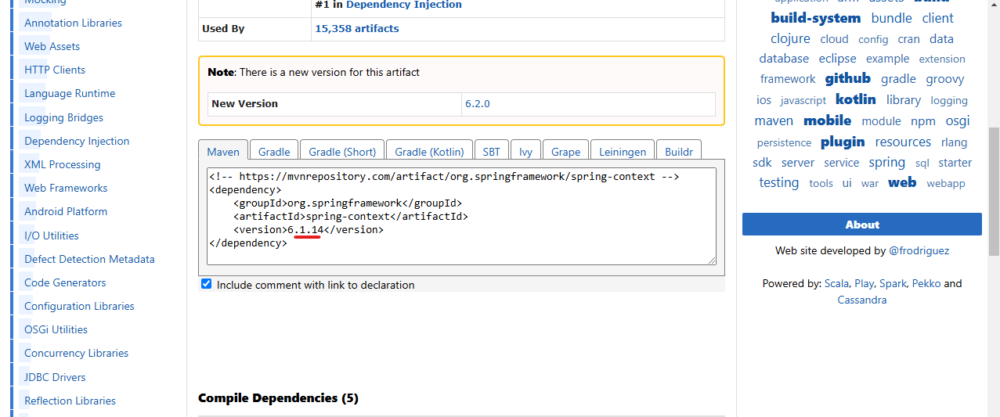  
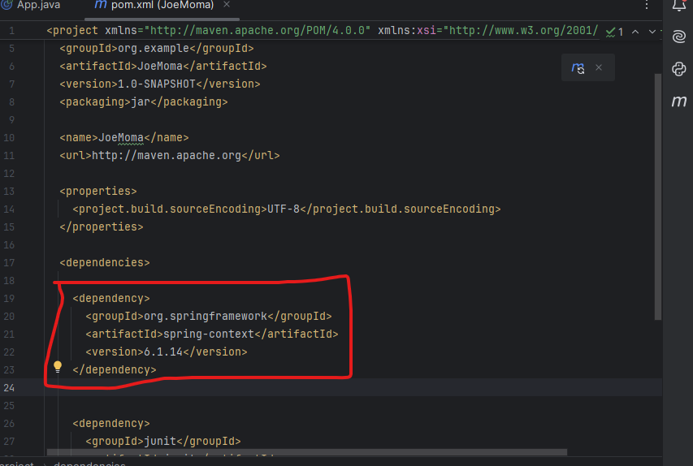  
& reload the project build
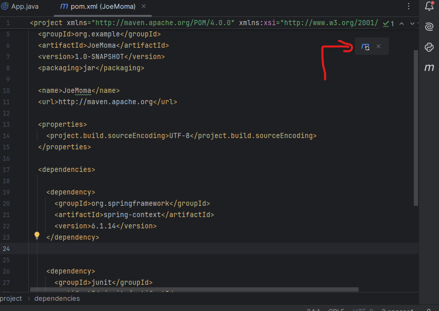  
### Preview:  
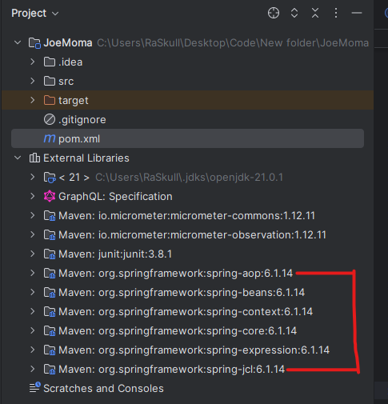  
now we can say we have all our neccesary spring libraries.  
but this is just a spring app now & not a spring boot app. so we dont have the run() method yet.  
but we do the job with its implementing, extendending interface or class.  

### Preview:  
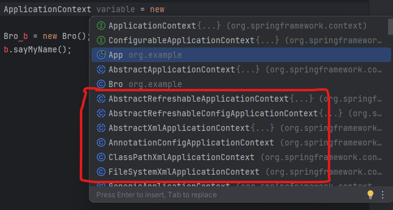  
spring boot do autoconfiguration & takes all care of it. but for manual job we have to take care of it.  
we will choose XML configuration for that.  