we will do each step, see each error then we will move forward, because thats a progressive learning.  
1. for XML approach we do this  
```java
    public static void main( String[] args )    {

        ApplicationContext variable = new ClassPathXmlApplicationContext();

        Bro b = variable.getBean(Bro.class); // @Component (annotation of Bro class)
        b.sayMyName();

    }
```  
### Preview:  
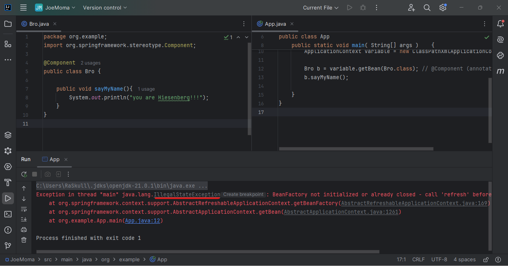 
it givings us `IllegalStateException` : `BeanFactory not initialized or already closed`  
because `ApplicationContext` extends `ListableBeanFactory`  
### Preview:  
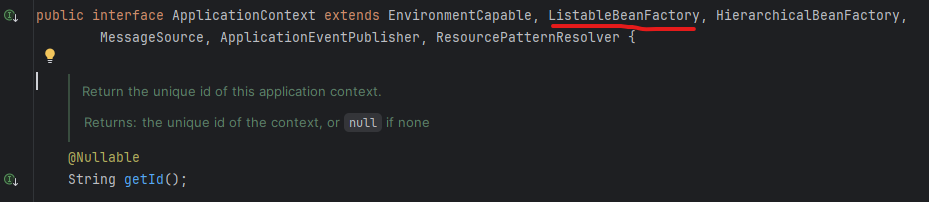  
& `ListableBeanFactory` extends `BeanFactory`  
### Preview:  
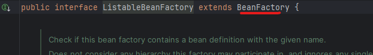  
but the error is that the execution is not getting configuration file, so we need to create congiguration file 1st then pass it to `ClassPathXmlApplicationContext()` method.  
2. configuration file creation.  
create `resources` folder inside main directory.  
then create `BRO.xml` configuration file inside it.  
### Preview:  
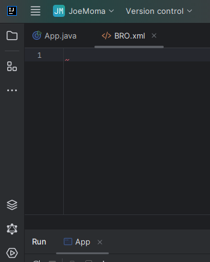  
now we have the xml file, how we will fill that?  
`https://docs.spring.io/spring-framework/docs/4.2.x/spring-framework-reference/html/xsd-configuration.html`
within this page we can find the bean boilerplate.  
### Preview:  
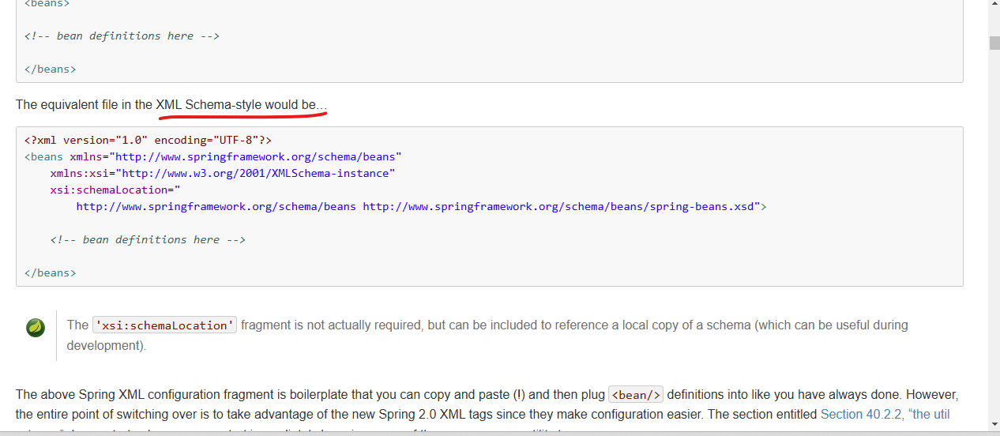
copy the bean boilerplate & paste it into our freshly created xml file  
```xml
<beans xmlns="http://www.springframework.org/schema/beans"
    xmlns:xsi="http://www.w3.org/2001/XMLSchema-instance"
    xsi:schemaLocation="
        http://www.springframework.org/schema/beans http://www.springframework.org/schema/beans/spring-beans.xsd">

    <!-- bean definitions here -->

</beans>
```    
### Preview:  
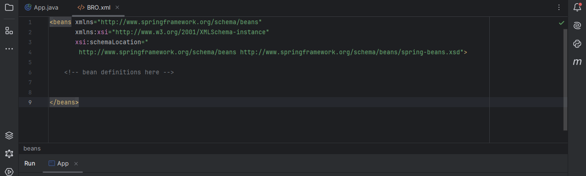  
& give the alteast one bean isnide it  
```xml
    <bean id="bro" class="org.example.Bro">

    </bean>
```  
### Preview:  
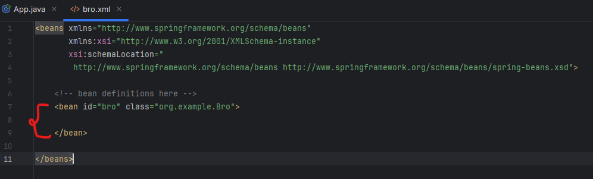  
then run the project once again  
### Preview:  
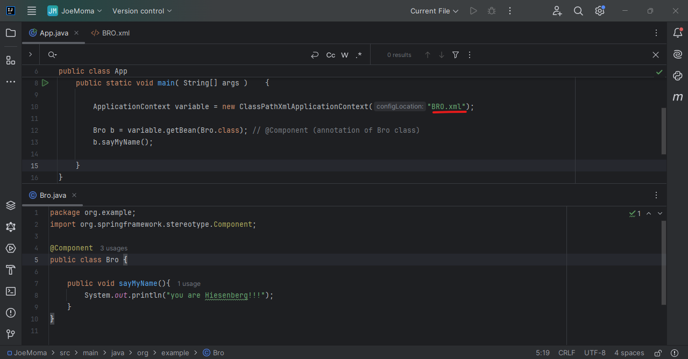  
now it works perfectly.  
```java
    public static void main( String[] args )    {

        ApplicationContext variable = new ClassPathXmlApplicationContext("bro.xml");

        Bro b = variable.getBean(Bro.class);
        b.sayMyName();
        
        Bro c = (Bro) variable.getBean("bro");
        c.sayMyName();
    }
```  
### Preview:  
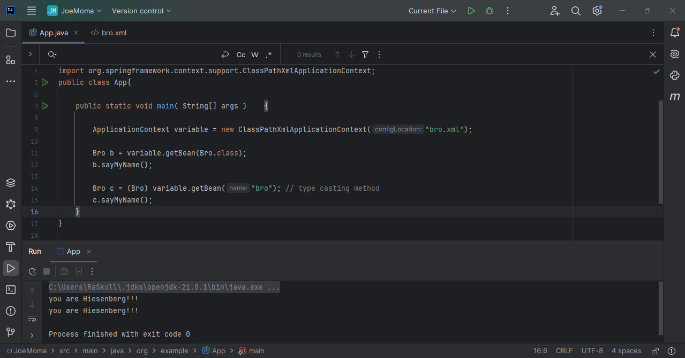  

## how many objects?  
lets make a constructor method which invokes at each object.  
```java
    public Bro(){
        System.out.println("cosntructor call for each object creation");
    }
```  
case 1: 2 object with 1 bean
### Preview:  
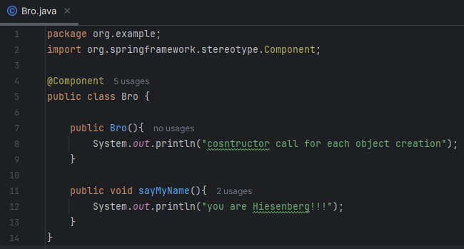  
### Preview:  
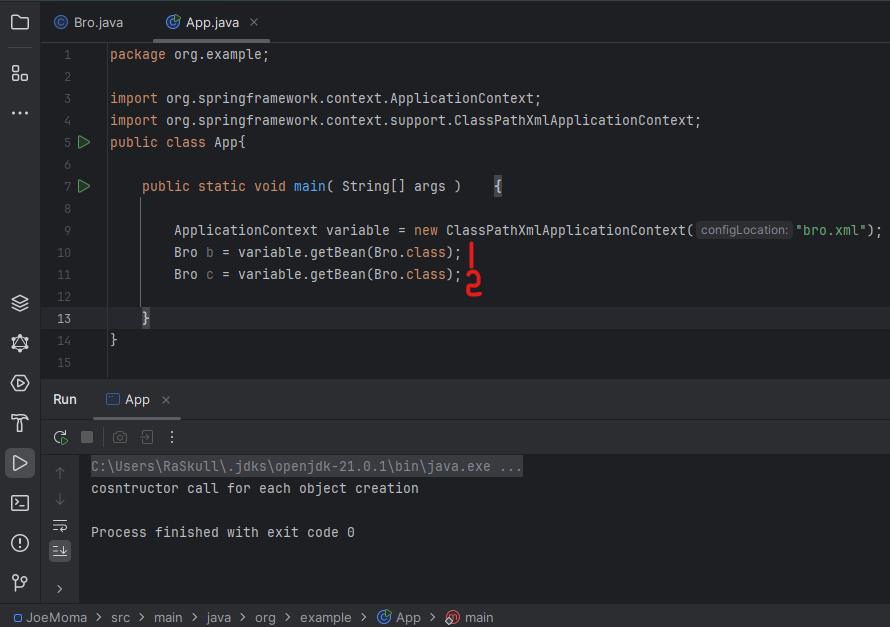  
so even with 2 objects it constructor only invoked once.  
case 2: 1 object with 2 beans
### Preview:  
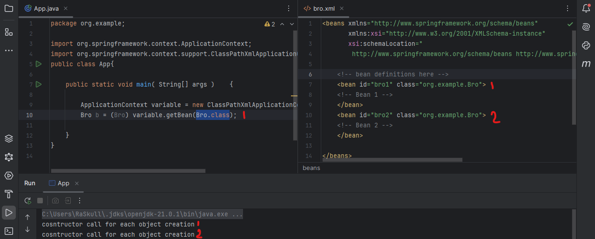  
