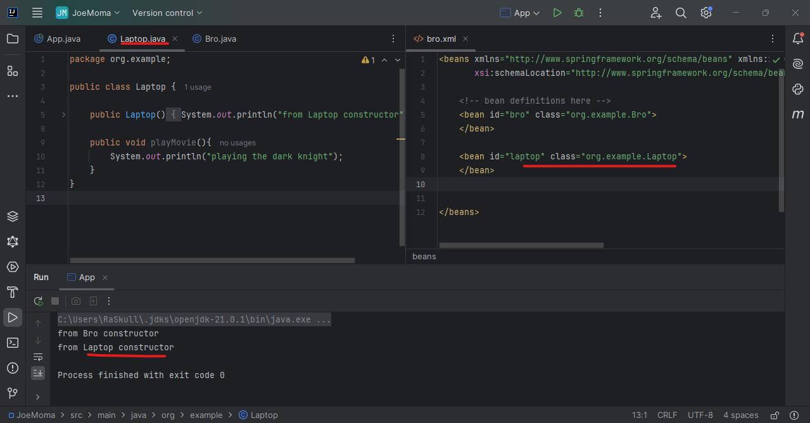
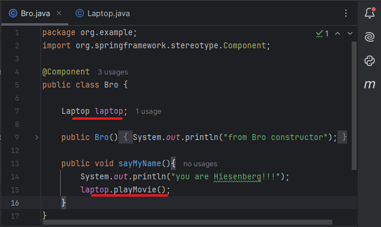

1. lets create laptop class in same package. give it a constuctor & one method.  
### Preview:  
  
now what we have to do is create a `laptop` object inside `bro` class.  
- step 1. laptop code  
```java
package org.example;

public class Laptop {

    public Laptop(){
        System.out.println("from Laptop constructor");
    }

    public void playMovie(){
        System.out.println("playing the dark knight");
    }
}
```  
- step 2. create instace & give method of laptop inside bro  
```java
package org.example;
import org.springframework.stereotype.Component;

@Component
public class Bro {

    Laptop laptop;

    public Bro(){
        System.out.println("from Bro constructor");
    }

    public void sayMyName(){
        System.out.println("you are Hiesenberg!!!");
        laptop.playMovie();
    }
}
```  
### Preview:  
  
- step 3. inside main app, create Bro instace & run its method.
```java
package org.example;

import org.springframework.context.ApplicationContext;
import org.springframework.context.support.ClassPathXmlApplicationContext;
public class App{

    public static void main( String[] args )    {

        ApplicationContext variable = new ClassPathXmlApplicationContext("bro.xml");

        Bro b = (Bro) variable.getBean("bro");
        b.sayMyName();
    }
}
```  
### Preview:  
  
### output  
  
it seems the execution cannot reach `playMovies()` method from laptop, with `NullPointerException` error.  
```bash
Exception in thread "main" java.lang.NullPointerException:
Cannot invoke "org.example.Laptop.playMovie()"
because "this.laptop" is null
```  
the main error is `"this.laptop"` which we will resolve in next session.  