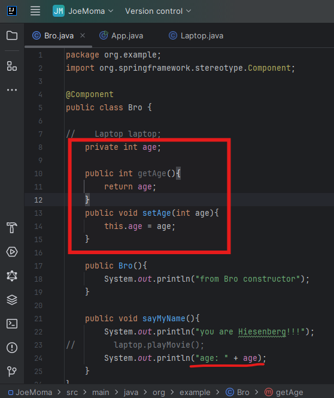
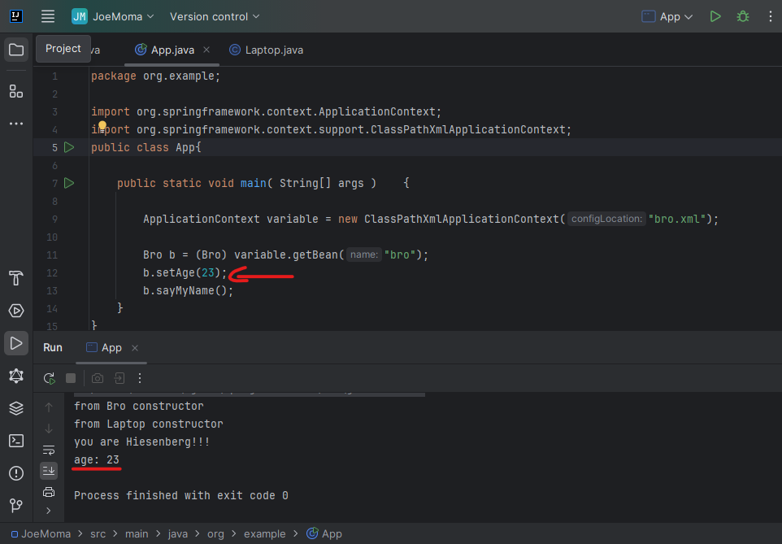

in last session we had this error.  
  
`Laptop class` >> inside `Bro class` method, laptop's method called(`playMovie()`) >> inside `App class` main method, Bro's method called (`playMovie()`), which called nested laptop method (`sayMyName()`)
because the laptop is getting null value, & if we see at screen shot we will know why, because there is no getter setter or constructor that injects value at App.java, but before we move forward to resolve this issue, we need to understand it with primitive datatype.  

## 1. manual wiring primitive datatype  
from `Bro.java`  
```java
package org.example;
import org.springframework.stereotype.Component;

@Component
public class Bro {

    Laptop laptop; // will remove this

    public Bro(){
        System.out.println("from Bro constructor");
    }

    public void sayMyName(){
        System.out.println("you are Hiesenberg!!!");
        laptop.playMovie();  // will remove this
    }
}
```  
we will remove commented area, laptop part & then only work with primitive value, like `int age`.  
```java
package org.example;
import org.springframework.stereotype.Component;

@Component
public class Bro {

//    Laptop laptop;
    int age;

    public Bro(){
        System.out.println("from Bro constructor");
        System.out.println("age: " + age);
    }

    public void sayMyName(){
        System.out.println("you are Hiesenberg!!!");
//        laptop.playMovie();
    }
}
```  
### Preview:  
  
after seeing output we say, the blank integer variable gives `0` value. but can we provide it explicit value.  
we have 2 options for that,
1. Getter & Setter   
### at `Bro.java` :  
added getter settter  
& printed value into explicit method  
  
### at `App.java` :  
passed value by setter method before the Bro's method is called  
  
but we are passing the manual value, we want to give it default value. how can we achieve that.  
Instance variables are known as `properties`. so we can pass the `property` tag into bean tag inside xml file.  
- we will remove setter methods from App class.  
- add `property` tag into xml file with `id` & `value` attribute.  
```xml  
    <bean id="bro" class="org.example.Bro">
        <property name="age" value="23" />
    </bean>
```  
### Preview:  
  
### Preview:  
  

2. Constructor injection 
now we will add two constructors in reffered class `Bro.java`
1st is empty constructor.  
2nd is parameterized constructor.  
the changed code will have proper comments  
```java
package org.example;
import org.springframework.stereotype.Component;

@Component
public class Bro {

    private int age;

    // empty constructor
        public Bro(){
        System.out.println("from empty Bro constructor");
    }

    // parameterized constructor
    public Bro(int age){
        this.age = age;
        System.out.println("from parameterized Bro constructor");
    }


    // getter & setter
    public int getAge(){
        return age;
    }
    public void setAge(int age){
        this.age = age;
        System.out.println("from Setter");
    }

    // method
    public void sayMyName(){
        System.out.println("you are Hiesenberg!!!");
        System.out.println("age: " + age);
    }
}
```  
for sake of learning we will comment  
```xml
    <bean id="bro" class="org.example.Bro">
    <!-- <property name="age" value="23" /> -->
    </bean>
```  
`<property>` tag from congif xml, becuase `<property>` works only for getter & setters, for constructor we need  `<construstor-arg>` tag, but we will do that later    
### Preview:  
  
so by default it it running empty constuctor  
now lets inject the `<construstor-arg>` tag into `bean`  
```xml
    <bean id="bro" class="org.example.Bro">
    <!-- <property name="age" value="23" /> -->
        <constructor-arg name="age" value="99" />
    </bean>v
```  
now lets re-run the app again.  
### Preview:  
  
now it injected the value using constructor injection & invoked parameterized constructor.  

## one thing more : for multiple fields  
- getter setters (property) by names
```xml
    <bean id="bro" class="org.example.Bro">
        <property name="name" value="gorav" />
        <property name="age" value="99" />
        <property name="address" value="india" />
    </bean>
```  
- getter setters (property) ❌ cannot support index

- constructor (constructor arguments) by names
```xml
    <bean id="bro" class="org.example.Bro">
        <constructor-arg name="name" value="gorav" />
        <constructor-arg name="age" value="99" />
        <constructor-arg name="address" value="india" />
    </bean>
```  
- constructor (constructor arguments) by index
```xml
    <bean id="bro" class="org.example.Bro">
        <constructor-arg index="0" value="gorav" />
        <constructor-arg index="1" value="99" />
        <constructor-arg index="2" value="india" />
    </bean>
```  
## 2. manual wiring class type  
now remove the int age code part from `Bro.java` and modify according to laptop.  
```java
package org.example;
import org.springframework.stereotype.Component;

@Component
public class Bro {

    private Laptop laptop;

    // empty constructor
        public Bro(){
        System.out.println("from empty Bro constructor");
    }

    // parameterized constructor
    public Bro(Laptop laptop){
        this.laptop = laptop;
        System.out.println("from parameterized Bro constructor");
    }

    // getter & setter
    public Laptop getLaptop() {
        return laptop;
    }
    public void setLaptop(Laptop laptop) {
        this.laptop = laptop;
    }

    // method
    public void sayMyName(){
        System.out.println("you are Hiesenberg!!!");
        laptop.playMovie();
    }
}
```  
now lets try first with  
- getters setters  
```xml
    <bean id="bro" class="org.example.Bro">
    <!-- <property name="age" value="23" /> -->
    <!--  <constructor-arg name="age" value="23" />-->
        <property name="laptop" ref="lappy" />
    </bean>

    <bean id="lappy" class="org.example.Laptop">
    </bean>
```  
& run the programm  
### Preview:  
after giving if to ref, (no value="" attribute because its not primitive & no hardcore value)  
  
now we can see there is no nullpoint error, the program is healthy.  
```xml
    <bean id="bro" class="org.example.Bro">

    <!-- <property name="age" value="23" /> -->
    <!--  <constructor-arg name="age" value="23" />-->

    <!-- <property name="laptop" ref="lappy" />-->
        <constructor-arg name="laptop" ref="lappy" />
    </bean>

    <bean id="lappy" class="org.example.Laptop">
    </bean>
```  
re-run  
### Preview:  
  
both works fine.  