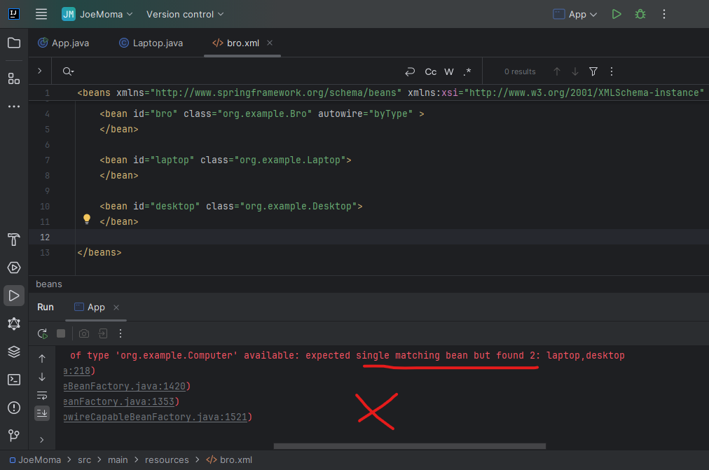

in previous session we saw how we do manual wiring   
```xml
    <bean id="bro" class="org.example.Bro">
    <!-- for primitive -->
    <!-- <property name="age" value="23" /> -->
    <!--  <constructor-arg name="age" value="23" />-->


    <!-- for classbase -->
    <!-- <property name="laptop" ref="lappy" />-->
        <constructor-arg name="laptop" ref="lappy" />
    </bean>
```  
now lets look how to do Autowiring.  
in auto-wire we can just pass the attribute `autowire="byName"` & it does the job
```xml
    <bean id="bro" class="org.example.Bro" autowire="byName" >
    </bean>

    <bean id="laptop" class="org.example.Laptop">
    </bean>
```  
### Preview:  
  
now lets go for some complex stuff, with interface or inheriting stuff.  
lets create an interface `Computer` & then inherits the methods.  
```
Computer  
    |- Laptop  
    |- Desktop  
```  
#### `Bro.java`  
creating Computer comp; & providing constructor, getter setter accordingly.  
```java
package org.example;
import org.springframework.stereotype.Component;

@Component
public class Bro {

    private Computer comp;

    // empty constructor
        public Bro(){
        System.out.println("from empty Bro constructor");
    }

    // parameterized constructor
    public Bro(Computer comp){
        this.comp = comp;
        System.out.println("from parameterized Bro constructor");
    }

    // getter & setter
    public Computer getComp() {
        return comp;
    }
    public void setComp(Computer comp) {
        this.comp = comp;
    }

    // method
    public void sayMyName(){
        System.out.println("you are Hiesenberg!!!");
        comp.playMovie();
    }
}
```  
#### `Computer.java`
```java
package org.example;

public interface Computer {

    void playMovie();
}
```  
#### `Desktop.java`  
inherited method  
```java
package org.example;

public class Desktop implements Computer{

    public Desktop(){
        System.out.println("from desktop constructor");
    }

    public void playMovie(){
        System.out.println("Playing Fight Club");
    }
}
```  
#### `Laptop.java`
inherited method  
```java
package org.example;

public class Laptop implements Computer{

    public Laptop(){
        System.out.println("from Laptop constructor");
    }

    public void playMovie(){
        System.out.println("playing the dark knight");
    }
}
```  
now we can still use `autowire="byName"`  
### Preview:  
  
but more robust approach is use `autowire="byType"` as it will look for parent class or interface.  
### Preview:  
  
what if we have multiple bean under same type with different ids  
```java

    <bean id="laptop" class="org.example.Laptop">
    </bean>

    <bean id="desktop" class="org.example.Desktop">
    </bean>

```  
lets find out  
### Preview:  
  
it is giving error.  
the solution is pass the `primary="true"` to desired bean.  
### Preview:  
  
now we assigned primary to Desktop class, it is giving output from desktop class.  