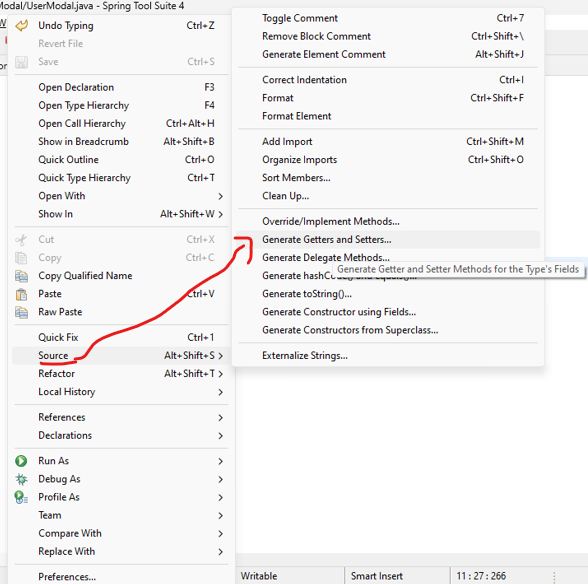
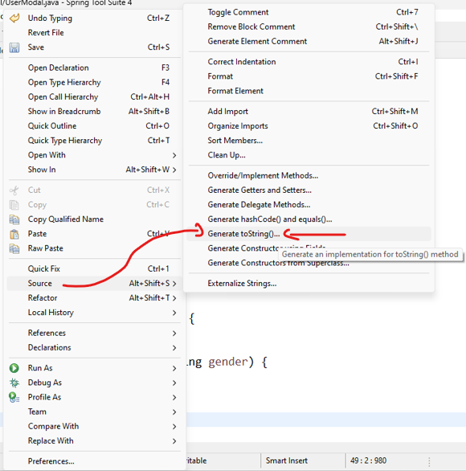

1. `src/main/java/com.your.packagename` : new class  
package: com.example.demo.Modal
name: UserModal  
2. input all the fields  
```java
	// strictly should be same as input name attribute
	private String fName;
	private String lName;
	private String email;
	private String password;
	private String dob;
	private String gender;
```  
3. right click => source => generate Getters & Setter => select the desired fields & generate  
### Preview:  
  
4. right click => source => generate toString() => select the desired fields & generate  
### Preview:  
  
full code  
```java
package com.example.SpringHTML.Modal;

public class UserModal {

	// strictly should be same as input name attribute
	private String fName;
	private String lName;
	private String email;
	private String password;
	private String dob;
	private String gender;
	public String getfName() {
		return fName;
	}
	public void setfName(String fName) {
		this.fName = fName;
	}
	public String getlName() {
		return lName;
	}
	public void setlName(String lName) {
		this.lName = lName;
	}
	public String getEmail() {
		return email;
	}
	public void setEmail(String email) {
		this.email = email;
	}
	public String getPassword() {
		return password;
	}
	public void setPassword(String password) {
		this.password = password;
	}
	public String getDob() {
		return dob;
	}
	public void setDob(String dob) {
		this.dob = dob;
	}
	public String getGender() {
		return gender;
	}
	public void setGender(String gender) {
		this.gender = gender;
	}
	
	@Override
	public String toString() {
		return "First Name: " + fName + ", Last Name: " + lName + ", email: " + email + ", password: " + password
				+ ", DOB: " + dob + ", gender: " + gender + "]";
	}
	
}
```  

5. now inside `Controller`  
use `@ModelAttribute` annotation & create `user` as instance from class `UserModal`
```java
	@PostMapping("/resister")
	public String userRegistration(@ModelAttribute UserModal user) {
		System.out.println(user.toString());
		return "index"; // you can change the html page name from here.
	}
```  
now stop the application by clicking red square on console & start the spring boot application again.  