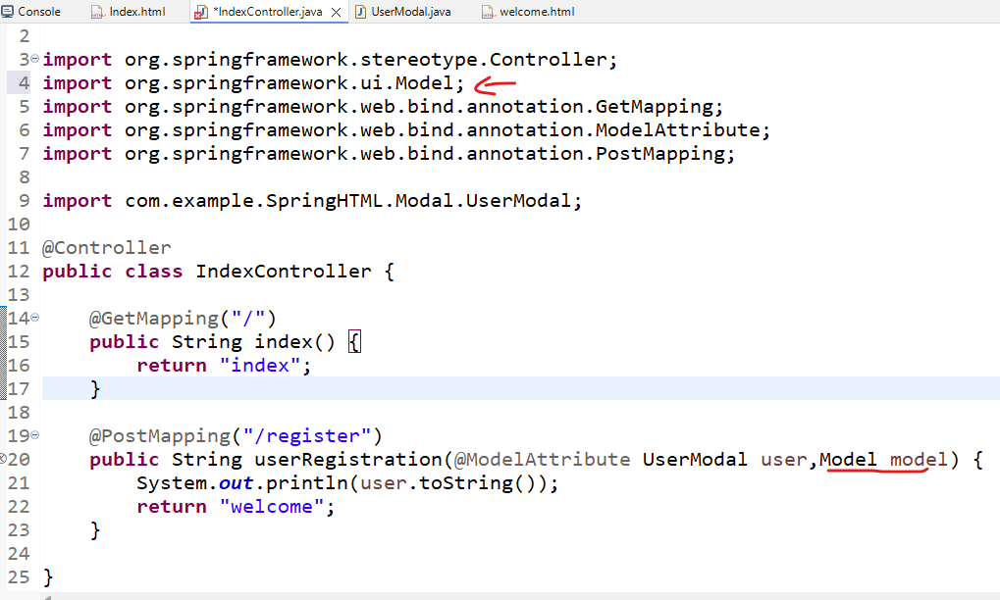
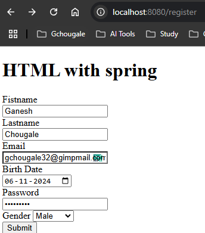
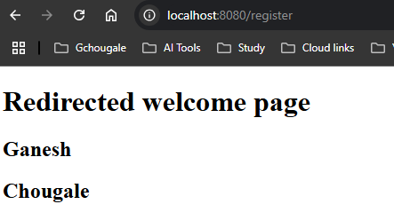

1. Create a new html page to welcome message  
```Html
<!DOCTYPE html>
<html lang="en">
<head>
    <meta charset="UTF-8">
    <meta name="viewport" content="width=device-width, initial-scale=1.0">
    <title>welcome page</title>
</head>
<body>
	<h1>Redirected welcome page</h1>
    
</body>
</html>
```

2. change the refernce of page from `index` to `welcome` from controller file
`src/main/java/Controller` => `IndexController.java`   
```java
	@PostMapping("/register")
	public String userRegistration(@ModelAttribute UserModal user) {
		System.out.println(user.toString());
		return "welcome";
	}
```   
we write welcome because our page name is `welcome.html`  
& pass the second parameter `Model model`  (import org.springframework.ui.Model;)  
### Preview:  
  
this Model object & model instance will help us to print the values  
& lastly get the values 
```java
		model.addAttribute("firstName",user.getfName());
		model.addAttribute("lastname",user.getlName());
```  
`IndexController.java` full code  
```java
package com.example.SpringHTML.Controller;

import org.springframework.stereotype.Controller;
import org.springframework.ui.Model;
import org.springframework.web.bind.annotation.GetMapping;
import org.springframework.web.bind.annotation.ModelAttribute;
import org.springframework.web.bind.annotation.PostMapping;

import com.example.SpringHTML.Modal.UserModal;

@Controller
public class IndexController {
	
	@GetMapping("/")
	public String index() {
		return "index";
	}
	
	@PostMapping("/register")
	public String userRegistration(@ModelAttribute UserModal user,Model model) {
		System.out.println(user.toString());
		model.addAttribute("firstName",user.getfName());
		model.addAttribute("lastname",user.getlName());
		return "welcome";
	}

}
```  
3. modify the welcome.html to print values  
using thymeleaf  
inside `<html>`  tag  
```html
<html lang="en" xmlns:th="https://www.thymeleaf.org">
```  
```html
	<h2 th:text="${firstName}"></h2>
	<h2 th:text="${lastname}"></h2>
```  
`welcome.html` full code:  
```html
<!DOCTYPE html>
<html lang="en" xmlns:th="https://www.thymeleaf.org">
<head>
    <meta charset="UTF-8">
    <meta name="viewport" content="width=device-width, initial-scale=1.0">
    <title>welcome page</title>
</head>
<body>
	<h1>Redirected welcome page</h1>
	
	<h2 th:text="${firstName}"></h2>
	<h2 th:text="${lastname}"></h2>
    
</body>
</html>
```  
### Feeding the values:  
  
### redirection:  
  