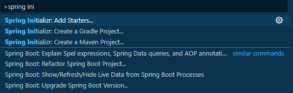

1. install `Spring Boot Tools` extension by `VMware`  
### Preview:  
  
2. create application:  
`ctrl` + `shift` + `p`  
OR  
View => Command Palette  

choose `Spring Initializr: Create a Maven Project`  
### Preview:  
  
& choose all the build configuration like we do in spring initiazr  
using website is always better that creating with VS code command palette  