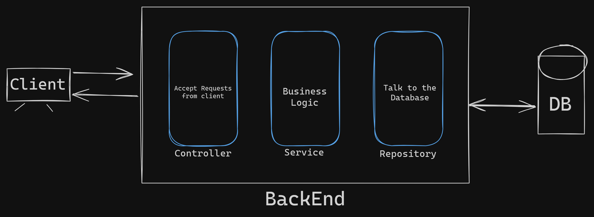
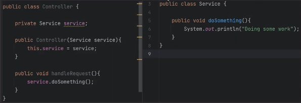
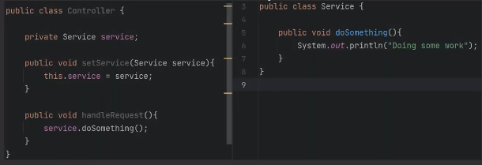

### Preview:  
  
if we have different layers means we have the different classes, in some cases we will have more than 2 or 3 digits of number of classes. so creating the instance object of classes in another class is not a scalable way to develope, here spring's IOC `(Inversion Of Control)` comes handy. & the main job of Spring IOC is `Dependancy Injection`.    
there are multiple ways of dependancy injection.  
### Example: we are using `Service` class in `Controller` class  
### 1. Constructor Injection:  
   
### 2. Setter Injection:  
   
