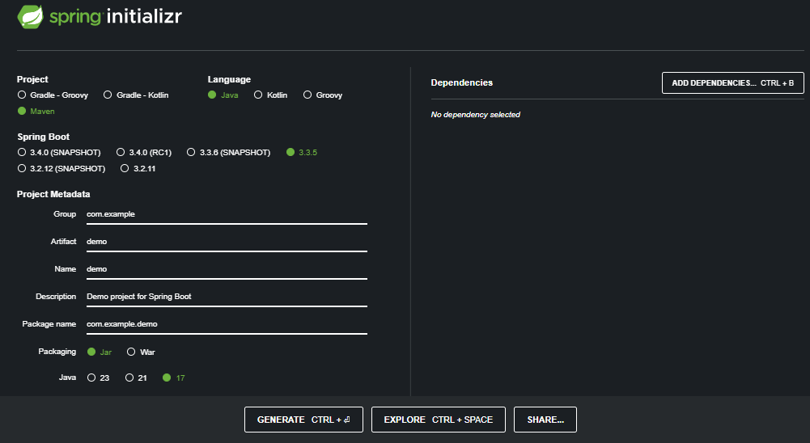

in spring initializer  
https://start.spring.io/  
### Preview:  
  
we can see those  
## 1. Project:  
a build tool, a project formatt, such as Maven or Gradle. mostly `Maven`.  
## 2. Language:  
Programming language, such as java, kotlin or groovy. mostly `Java`.  
## 3. Spring Boot Version  
version of spring boot. usually donot choose snapshot version. others are stable version  

## 4. Project Metadata  
### A. Group:  
defines the base package or group for project. mostly the company domain in reverse (`mycompany.service.com` => `com.service.mycompany`) 
### B. Artifact  
Name of Project / Application  
### C. Name  
A user-friendly name for the application  
### D. Description:  
A brief description of the project.  
### E. Package:  
Defines the package structure.  
### F. Packaging:  
Choose between `JAR` (ideal for microservices) or `WAR` (ideal for web server) packaging.  
### G. Java Version:  
Select the version of Java you want to use.  
## 5. Dependencies:  
You can add dependencies for your project, such as Spring Web, Spring Data JPA, Spring Security, etc.  
## 6 Generate:  
After configuring, the tool generates a zip file containing the base project setup, which you can download and start working with.  