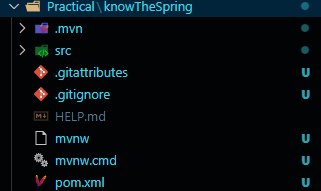

### Preview:  
  

# A. Root Directory (/)  
## 1. pom.xml (for Mavel), build.gradle (for gradle)  
This file contains information about the project's dependencies, build settings, plugins, and more.    
## 2. src/  
This directory contains your source code, both for Java (or Kotlin) and resources.  
## 3. target/ (for Mavel),  build./ (for gradle)  
This directory contains compiled files, JAR/WAR files, and other build-related artifacts. It’s typically created when you build your project and is not included in version control.  
## 4. .gitignore  
If you're using Git for version control, this file specifies which files and directories should be ignored (like target/ or build/).  
## 5. README.md  
A markdown file that typically explains the project, how to run it, and any other relevant information.  

# B. src/ 
## 1. src/main/  
This is the main source folder that includes all your application code and resources.  
### I. src/main/java/  
Contains all the Java source files. The structure under this folder is usually based on the package naming convention. For example, if your base package is com.example.demo, the full path would be src/main/java/com/example/demo/.  
#### Application.java  
This is the main entry point of your Spring Boot application. It contains the @SpringBootApplication annotation and the main() method that starts the application.  
#### Controllers `(controller/)`  
This package contains classes annotated with `@RestController` or `@Controller` to handle incoming HTTP requests.  
#### Services `(service/)`  
Contains service classes that contain the business logic of your application. Typically annotated with @Service.  
#### Repositories `(repository/)`  
Contains classes for interacting with the `database`, typically annotated with `@Repository` (often using Spring Data JPA or other persistence frameworks).  
#### Models `(model/ or domain/)`  
Contains the POJOs (Plain Old Java Objects) that represent your entities or data models (e.g., User, Product, etc.).  
#### Configuration `(config/)`  
Holds configuration classes for beans, security, database, etc.  

### II. src/main/resources/  
Contains resources such as configuration files, static files, templates, and application properties.  
#### `application.properties` or `application.yml`  
The main configuration file of a Spring Boot application. It contains settings such as database configurations, server port, logging, etc.  
#### static/  
Contains static resources like `CSS`, `JavaScript`, `images`, etc., which are served directly to clients in web applications.  
#### templates/  
Contains view templates (e.g., Thymeleaf templates) that can be rendered on the server side.  
#### `application-dev.properties` or `application-prod.properties`  
Environment-specific property files for different environments like development, production, etc. These are typically used in conjunction with Spring Profiles to load different configurations based on the environment.  
#### `logback.xml` or `log4j2.xml`  
Configuration for logging (if you use a custom logging setup).

## 2. src/test/  

### Unit tests (Test)  
Test classes that contain unit tests for your services, controllers, repositories, etc. Typically use libraries like JUnit and Mockito for testing.
### Integration tests  
These tests typically verify that various parts of the application work together correctly, often with an actual database or web server in place.

## Full File Structure of Spring  
```scss
my-spring-boot-app/
├── pom.xml (or build.gradle)
├── src/
│   ├── main/
│   │   ├── java/
│   │   │   └── com/
│   │   │       └── example/
│   │   │           └── demo/
│   │   │               ├── Application.java
│   │   │               ├── controller/
│   │   │               │   └── HelloController.java
│   │   │               ├── service/
│   │   │               │   └── HelloService.java
│   │   │               ├── model/
│   │   │               │   └── User.java
│   │   │               └── repository/
│   │   │                   └── UserRepository.java
│   │   └── resources/
│   │       ├── application.properties
│   │       ├── static/
│   │       │   └── css/
│   │       │       └── style.css
│   │       └── templates/
│   │           └── hello.html
├── target/  (generated by Maven or Gradle)
└── README.md
```
