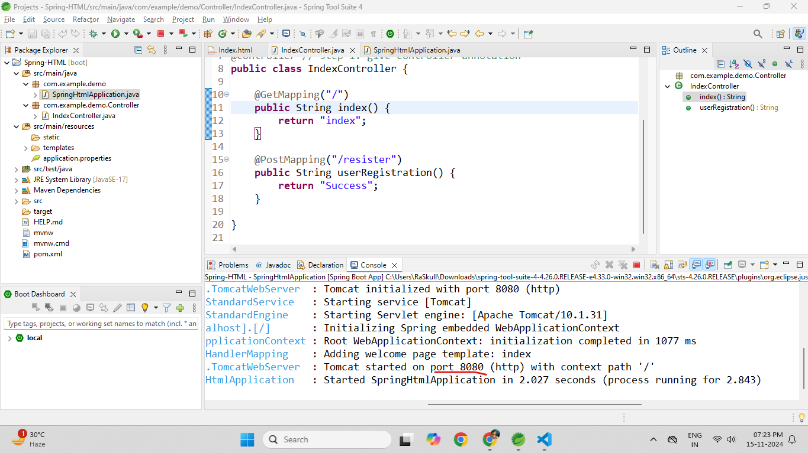
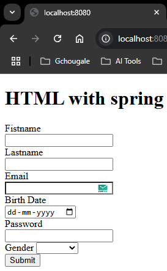

1. `src/main/java/com.your.packagename` : new class
package: com.example.demo.Controller
name: IndexController   
2. give Controller annotation to the public class  
```java
@Controller // give Controller annotation
public class IndexController {

}
```  
3. add functions inside it  
```java
	@GetMapping("/")
	public String index() {
		return "index";
	}
	
	@PostMapping("/resister")
	public String userRegistration() {
		return "index";
	}

```   
4. just run the application `src/main/java/demo` : `SpringHtmlApplication.java` run as spring boot application  
if everything goes right you will see the port in terminal.  
### Preview:  
;  
5. run the `[localhst:8080](http://localhost:8080/)`  
### Preview:  
  

full snipper  
```java
package com.example.SpringHTML.Controller;

import org.springframework.stereotype.Controller;
import org.springframework.web.bind.annotation.GetMapping;
import org.springframework.web.bind.annotation.ModelAttribute;
import org.springframework.web.bind.annotation.PostMapping;

import com.example.SpringHTML.Modal.UserModal;

@Controller
public class IndexController {
	
	@GetMapping("/")
	public String index() {
		return "index";
	}
	
	@PostMapping("/register")
	public String userRegistration(@ModelAttribute UserModal user) {
		System.out.println(user.toString());
		return "index";
	}

}
```  